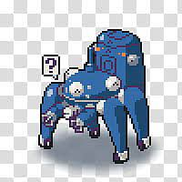

<p align="center">
  <a href="#">
</a>
  <h4 align="center"><font color="#966661">Tachikuma</font>:  How far can intelligent agents with comprehensive world model to go?</h4>
  <p align="center">
    <a href='https://arxiv.org/abs/2307.12573'></a>
  </p>
</p>


# Introduction to the Tachikuma Project: Roadmap for Humanoid Agents

The Tachikuma project is inspired by the fascinating and intricate characters in "Ghost in the Shell", particularly the Tachikoma. Our ambitious objective is to develop humanoid agents. We envision agents that deeply understand human intentions, exhibit sufficient intelligence, and eventually, even reach a state of self-awareness.

To actualize this vision, our research roadmap bifurcates into two primary trajectories:

## 1. Development of Singular Humanoid Agents

We categorize the desired capabilities of these agents into three foundational pillars:

- **Understanding Human Inputs:**  The agent must understand varied human inputs, from instructions to abstract semantics, with an emphasis on grasping underlying human intentions. Despite numerous research endeavors in this realm, there remains a dearth of datasets or tasks tailored to intention understanding within intricate, grounded, multi-character interactions. Our recent work, available on [Arxiv](https://arxiv.org/abs/2307.12573), pioneers this domain. 

While the role of future Large Language Models (LLMs) in addressing this challenge remains uncertain, my hypothesis is that as LLMs evolve in various abilities, they may only require particular prompting or limited datasets to understand and articulate intentions, rather than rigorous intention-specific training. Given the subjective and biased nature of human intentions, dedicating LLMs to this task might be suboptimal. Their potential could be better harnessed in absorbing objective and precise knowledge. Our publication on [Arxiv](https://arxiv.org/abs/2307.12573) seeks to lay a foundation on this point and provide a benchmark for evaluating and understanding the capabilities of various LLMs in understanding human intentions.


- **Cognitive Intelligence and Knowledge Assimilation:** An ideal agent would perceive, comprehend, and reason with the information at hand, harnessing the power of LLMs.

- **Interactivity with the Environment:** The agent is capable of producing accurate outputs, exchanging information, and interacting with both environments and humans without limitation.

> While I'll be concentrating predominantly on the first pillar, the advancements from the broader research community will be invaluable in enriching the latter two components (e.g., pursuing more powerful large models, embodied AI, or some game agents). 

## 2. Establishment of a Comprehensive World Model for Multi-Agent Community

This entails:

- **Inter-Agent Interaction Framework:** Drawing parallels with human society, agents should interact based on a set of rules, e.g., moral guidelines, social norms, individual personality traits, etc. 

- **Agent-Environment Interaction Framework:** Think of this as creating a holistic biotope for our agents. They should be equipped to handle diverse environmental stimuli and adapt to changing conditions. For instance, an agent should be aware that recently boiled water in its virtual environment isn't fit for immediate consumption and should adjust its actions accordingly. All the information or feedback should be comprehensively and accurately provided by the world model for agents. 

The humanoid agents in recent works show promising signs of collaboration and communication, yet there's ample room for sophistication. Driven by my insatiable curiosity, I am eager to explore how agents, when equipped with rich backgrounds and intricate world models, will behave. Through the Tachikuma project, I aspire to sculpt a comprehensive environment for these agents, fostering more nuanced, diverse, and even spontaneous behaviors in them.

---

I warmly extend an invitation to fellow researchers to embark on this exhilarating journey with us, as we strive to bridge the gap between agents and genuine human. 


## Citation
```
@article{liang2023tachikuma,
  title={Tachikuma: Understading Complex Interactions with Multi-Character and Novel Objects by Large Language Models},
  author={Liang, Yuanzhi and Zhu, Linchao and Yang, Yi},
  journal={arXiv preprint arXiv:2307.12573},
  year={2023}
}
```